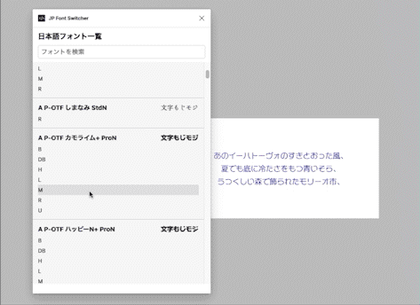

# JP Font Switcher
 

JP Font Switcherは、Figma上で日本語フォントを簡単に切り替えることができるプラグインです。




## 機能

- 日本語フォントの一覧表示
- 日本語フォントの検索
- フォントスタイルの選択と適用（複数テキスト同時適用可）

## インストール方法

1. このリポジトリをクローンまたはダウンロードして、ローカルに保存。
2. Figmaで、右上のハンバーガーメニューを開き、`Plugins(プラグイン)`>`development(開発)`>`import plugin from manifest(マニュフェストからプラグインをインポート)`を選択
3. ダウンロードしたディレクトリ内の`manifest.json`ファイルを選択して、プラグインをインストール

## 使い方

1. Figmaでテキストオブジェクトを選択
2. ブラグインメニューから、`JP Font Switcher`を選択
3. プラグインのウィンドウで、任意のフォントのスタイルをクリック

---

## 特定のローカルのフォントが表示されないとき
JP Font Switcherでは、現在使用可能な日本語フォントをリストアップしていますが、ユーザーのローカル環境にインストールされているフォントは自動的に表示されません。これは、プラグインがFigmaが認識できるフォントリストに基づいて動作しており、ローカルにインストールされたフォントはこのリストに含まれていないためです。
ローカル環境にインストールされているフォントをプラグインに表示させるには、以下の手順を実行してください。

1. プロジェクトディレクトリ直下にある`fontList.js`に追加したいフォントを以下のフォーマットで追加
```js
export const fontList = {
    "02UtsukushiMincho": "02うつくし明朝体",
    "03SmartFontUI": "03スマートフォントUI",
    "07LightNovelPOP": "07ラノベPOP",
    "07NikumaruFont": "07にくまるフォント",
    ...
    // ここに好きなフォントを追加
    "{Figmaでのフォントの表示名（英語）}": "{フォントの日本語名}"
}
```
※ Figmaでのフォントの表示名が異なると動作しないのでご注意下さい。<br>
※ フォントはこのリストの順番で表示されますので、好きな順番に変更して構いません。<br>
※ ローカルにないフォントは表示されませんが、動作が重い場合などは不要なフォントを削除していただいて構いません。


2. プロジェクトでディレクトリで以下のコマンドを実行
```
npm run build
```

3. Figmaのプラグインを再起動すると、フォント一覧が更新されてる


## 開発者

JP Font Switcherは、[@avocadoneko](https://github.com/avocadoneko)によって開発されました。ご質問やフィードバックがある場合は、GitHubの[Issues](https://github.com/avocadoneko/JPFontSwitcher/issues)にてお気軽にお問い合わせください。

## Special Thanks

This project has been developed with the help of [OpenAI's ChatGPT](https://www.openai.com/products/chatgpt/), a state-of-the-art language model that assisted in generating code and providing guidance throughout the development process.
